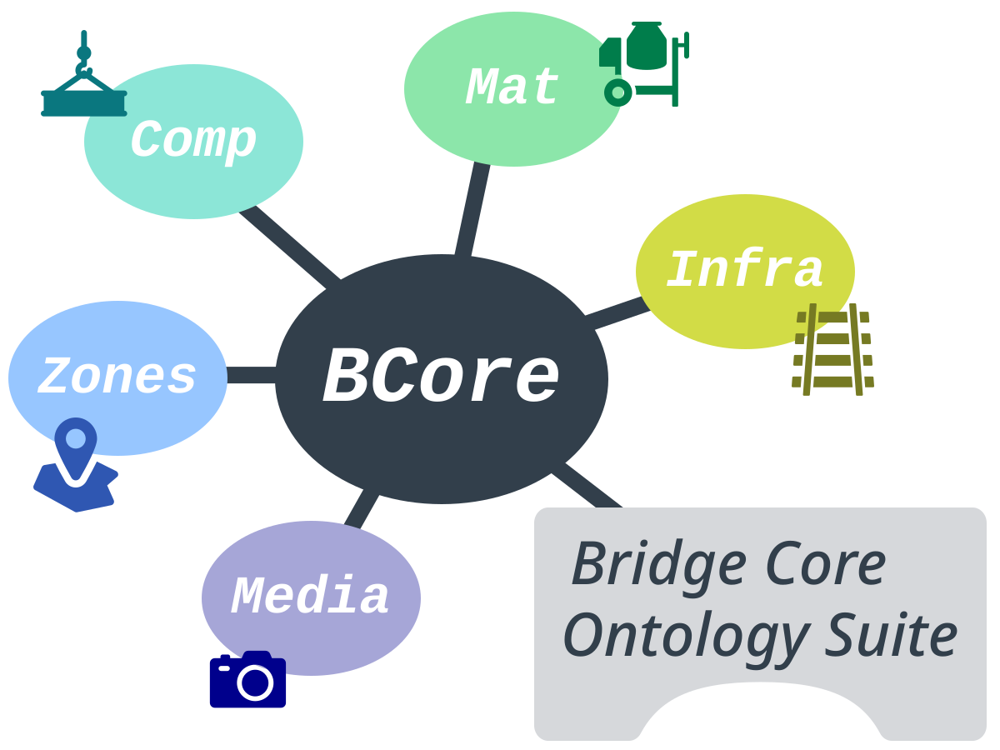

# Bridge Core Ontology

The **Bridge Core Ontology (BCore)** provides the semantic foundation for representing bridges in a modular and extensible way. It defines the essential concepts needed to describe a bridge, its identity, and its top‑level structure. All other BCore modules build on this core and extend it with domain‑specific detail.
    
Recommended namespace for BCore: **`bcore`** and its modules: **`bcore<module>`**.

## BCore Modules

The BCore ecosystem consists of several modular ontologies, each addressing a specific domain while remaining fully interoperable:

| Module | URI | Purpose |
|--------|------|---------|
| **[BCore](https://w3id.org/bcore)** | `https://w3id.org/bcore` | Core identity, top‑level bridge concepts, shared linking structure |
| **[BCoreComp](https://w3id.org/bcore/comp)** | `https://w3id.org/bcore/comp` | Structural and functional bridge components |
| **[BCoreMat](https://w3id.org/bcore/mat)** | `https://w3id.org/bcore/mat` | Materials used in bridge construction |
| **[BCoreInfra](https://w3id.org/bcore/infra)** | `https://w3id.org/bcore/infra` | Surrounding transport and utility infrastructure |
| **[BCoreZones](https://w3id.org/bcore/zones)** | `https://w3id.org/bcore/zones` | Spatial zones, geometric context, environmental regions |
| **[BCoreMedia](https://w3id.org/bcore/media)** | `https://w3id.org/bcore/media` | Media files, documentation, and digital assets |

## BCore Extensions

| Namespace | URI | Title |
|--------|------|---------|
| **[BEDRO](https://w3id.org/bedro)** | `https://w3id.org/bedro` | Bridge Element Design Rule Ontology |

## Acknowledgements

BCore reuses established concepts from well‑known ontologies to ensure interoperability:

| Namespace | URI | Title |
|--------|------|---------|
| **[BOT](https://w3id.org/bot)** | `https://w3id.org/bot` | Building Topology Ontology |
| **[BROT](https://w3id.org/brot)** | `https://w3id.org/brot` | Bridge Topology Ontology |
| **[RELOC](https://w3id.org/reloc)** | `https://w3id.org/reloc` | Relative Location Ontology |

*Icons used in the BCore logo: [Bridges](https://thenounproject.com/icon/bridges-7745970/), [Girder](https://thenounproject.com/icon/girder-5517023/), [Railway](https://thenounproject.com/icon/railway-8395550/), [Concrete](https://thenounproject.com/icon/concrete-2476665/), [Region](https://thenounproject.com/icon/region-3097495/), [Camera](https://thenounproject.com/icon/camera-1091895/) via [Noun Project](https://thenounproject.com/)*

## Contact

- **Tim Noack** • [`tim.noack@tu-dresden.de`](tim.noack@tu-dresden.de) • GitHub: [**NoackTim**](https://github.com/NoackTim)
- **Johannes Reimer** • [`johannes.reimer@tu-dresden.de`](johannes.reimer@tu-dresden.de) • GitHub: [**JohannesReimer**](https://github.com/JohannesReimer)